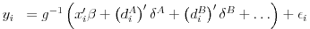
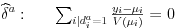
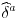

# glmhdfe – Package for R

The `R` package `glmhdfe` allows for the estimation of generalized linear models with high dimensional fixed effects. The package makes use of a convenient property of *some* combinations of error term distributions and link functions, where the fixed effects have — conditional on all other estimated parameters — an explicit solution.

Consider the following equation that we want to estimate:



The first order conditions for fixed effects can be simplified to



For certain distribution and link combinations this yields explicit solutions for the estimated coefficient for the fixed effects , given estimates for beta and the other deltas. Specifically, this is the case for the Gaussian distribution with identity and log link, and for the Poisson, Gamma and Inverse Gaussian distributions with log link. This makes it possible to update the fixed effects separately from the estimation of the coefficients on variables of interest in every iteration of the IRLS procedure used to estimate beta, dramatically increasing the speed of the estimation procedure.

For more detail on the inner workings see the [technical note](resources/glmhdfe_technical_note.pdf). A `Stata` implementation is coming soon.<!--For details on the `Stata` implementation consult the [Stata readme file](https://github.com/julianhinz/glmhdfe/Stata_glmhdfe).-->

# Implementation in R

The R package `glmhdfe` implements this "trick" and utilizes the powers of the `data.table` package for a fast implementation. For smaller datasets or other error term distributions we recommend the `feglm` command in Amrei Stammann's [`alpaca` package](https://github.com/amrei-stammann/alpaca) that also allows high-dimensional fixed effects in GLM estimations.

## Installation

Install from Github via the [remotes](https://remotes.r-lib.org) package:
```R
remotes::install_github("julianhinz/R_glmhdfe")
```

## Examples

The `glmhdfe` function has a similar syntax as the `felm` function from the `lfe` package and the `feglm` function in the `alpaca` package:
```R
glmhdfe(trade ~ fta | iso_o_year + iso_d_year + iso_o_iso_d | iso_o + iso_d + year,
        family = poisson(link = "log"),
        data = data)
```
The first part of the formula is specified as usual. The second part of the formula specifies the fixed effects dimensions, the third part, which is optional, the clustering of the standard errors.

### Options

There are numerous options to tweak the estimation procedure:

* `formula` describes dependent variable, right-hand side variables of interest, sets of fixed effects and clustering of standard errors, e.g. as `y ~ x | fe1 + fe2 | cluster1 + cluster2`
* `data` specifies the `data.table` or `data.frame` with data used in the regression
* `family` specifies the estimator used, currently limited to `gaussian(link = "identity")`, `gaussian(link = "log")`, `poisson(link = "log")`, `Gamma(link = "log")`
* `beta` allows to include a vector of starting values, although, interestingly, this does not tend to speed up the estimation
* `tolerance` specifies the minimum change in the deviance at which the iteration breaks
* `max_iterations` specifies the maximum number of iterations
* `accelerate` specifies whether to use an acceleration algorithm, still quite buggy
* `accelerate_iterations` specifies the number of iterations before starting acceleration algorithm
* `accelerate_aux_vector` specifies whether to include the *estimated* fixed effects vectors in IRLS, which, interestingly, increases convergence speed
* `compute_vcov` asks whether to compute the variance-covariance matrix. It can also be computed ex-post when data from estimation is provided
* `demean_variables` if you don't want to compute the variance-covariance matrix right away, do you still want to demean variables to be used in estimation of variance-covariance matrix?
* `demean_iterations` specifies the number of iterations for the demeaning
* `demean_tolerance` specifies the minimum change in the diagonal of the Hessian at which the demeaning iteration breaks
* `include_fe` asks whether the estimated fixed effects should be returned
* `include_data` asks whether the data used in the estimation should be returned, which may be useful if the variance-covariance matrix will be computed ex-post
* `include_data_vcov` return data used in variance-covariance matrix estimation?
* `skip_checks` specifies, whether certain data integrity checks should be skipped before starting the procedure. Current option to skip are the detection of separation issues (`"separation"`), multicollinearity (`"multicollinearity"`), or missing data (`"complete_cases"`)
<!--* `force_generic` doesn't do anything currently. In the (near) future this option asks, whether the usually much faster fixed effects separation in the estimation procedure should be prevented. This is sort of a convenience option in case one wants to estimate other, non-hardcoded family-link combinations. In most cases we would then recommend using the `feglm` command from the `alpaca` package instead.-->
* `trace` asks whether to show some information during the estimation
* `verbose` asks whether to show a bit more information during estimation for the impatient

### Other functions

There is the usual battery of generic functions, like `coef`, `summary`, etc. Furthermore, if for some reason you want to (re-)estimate the variance-covariance matrix afterwards, or change the level of clustering, you can do so with the `compute_vcov` command:
```R
compute_vcov(data, call, info)
```
You need to specify the data (best in the form of a `glmhdfe_data` object), call (for information on clustering and variable of interest), and info (for information on degrees of freedom, etc.).

## Roadmap
* tests using `testthat`
* parallelization in `Rcpp` with `omp`
* Inverse Gaussian with log link
* allow transformations in formula
* detect collinearity with `lmhdfe` or other `data.table` routine, not `felm` because this slows it down
* run first IRLS with transformed lhs, otherwise beta guess only works for gaussian
* faster checks for multicollinearity
* faster checks for separation issues
- [x] try `eval` on variables that are not part of data, e.g. for something like `y ~ log(x)`
<!--* fallback option for generic family-link combinations-->

## Bugs?

* This package is still in its early stages. Let us know if you find bugs or have suggestions for changes by opening an issue or e-mail to [mail@julianhinz.com](mailto:mail@julianhinz.com?subject=glmhdfe%20package).
